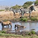
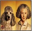
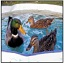
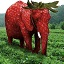
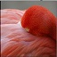
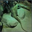
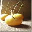

# Out of distribution
A repo for out of distribution experiments in XAI

[Headgear](https://htmlpreview.github.io/?https://github.com/k3larra/ood/blob/main/headgear_version01.html)

[animals](https://htmlpreview.github.io/?https://github.com/k3larra/ood/blob/main/animals_version01.html)

[Information on pretrained models used](https://github.com/k3larra/ood/blob/main/models.md)

[animals](https://htmlpreview.github.io/?https://github.com/k3larra/ood/blob/main/animals/version01/image0/image0.PNG)

## groups of images:
All percentage over 20
|Image |label1/%/models        |label2/%        |label3/%     |ood comment                                    | 
|------|-----------------------|----------------|-------------|-----------------------------------------------|
|![][0]|sorrel/55.8/8          |Great Dane/4.2/5|             |                                               |                         
|![][1]|zebra/48.4/8           |hyena/24.8/8    |             |                                               |                         
|![][2]|Golden Retriever/29.2/8|Chesapeake Bay  retriever/22.0/8|Irish setter/6.9/8|                      |   
|![][3]|standard poodle/34.7/8 |miniature poodle/19.3/8|toy poodle/11.6/8 |                                   |           
|![][4]|drake/33.4/8           |diaper/14.4/1   |quilt/7.8/1  |                                               |                           
|![][5]|triceratops/27.5/8  |strawberry/22.4/8|tusker/3,8/7   |                                               |                         
|![][6]|flamingo/83.4/8         |               |             |                                               |                         
|![][7]|Komodo dragon/31.7/7  |frilled lizard/16.7/8|marmoset/20.4/3|                                         |                         
|![][8]|--  |--|             |             |                         |                         
|![][9]|--  |--|             |             |                         |                         

 
 

 
 
 

[0]: testset/animals_thumbnails/1.jpg
[1]: testset/animals_thumbnails/10.jpg
[2]: testset/animals_thumbnails/2.jpg
[3]: testset/animals_thumbnails/3.jpg
[4]: testset/animals_thumbnails/4.jpg
[5]: testset/animals_thumbnails/5.jpg
[6]: testset/animals_thumbnails/6.jpg
[7]: testset/animals_thumbnails/7.jpg
[8]: testset/animals_thumbnails/8.jpg
[9]: testset/animals_thumbnails/9.jpg
