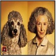

# Exploring Out-Of-Distribution in Image Classification for Neural Networks via Concepts
Website accompanying the paper with the above title:

**Abstract** *The currently dominating artificial intelligence and machine learning technology, neural networks, builds on inductive statistical learning processes. Being void of knowledge that can be used deductively these systems cannot distinguish exemplars part of the target domain from those not part of it. This ability is critical when the aim is to build human trust in real-world settings and essential to avoid usage in domains wherein a system cannot be trusted. In the work presented here we conduct two qualitative contextual user studies and one controlled experiment to uncover research paths and design openings for the sought distinction. Through our experiments, we find a need to refocus from average case metrics and benchmarking datasets toward systems that can be falsified. The work uncovers and lays bare the need to incorporate and internalise a domain ontology in the systems and/or present evidence for a decision in a fashion that allows a human to use our unique knowledge and reasoning capability.*

###### This site adds code and additional material for reproducibility and additional material.

**Study 1:** This study investigated whether it is useful, for a human, to categorise visible sub-concepts in images picturing animals as necessary, sufficient and, additionally, the usefulness of the notion of spurious correlations concerning concepts not deemed as necessary or sufficient. By using these notions we for this study hypotesize that they can make it easier to identify o.o.d exemplars. Concepts discussed here were then sub-concepts to animal classifications, as, for example, 'watering hole', 'beak' or 'feather'.

[Information for animal study](images/animals/0.PNG)

[](images/animals/1.PNG)
[](images/animals/2.PNG)
[](images/animals/3.PNG)
[](images/animals/4.PNG)
[](images/animals/5.PNG)
[](images/animals/6.PNG)

[Final questions](images/animals/7.PNG)


Link to code for the predictions:

**Study 2:** This study focused on a more narrow domain headgear and the seven directly related classes in ImageNet-1K: sombrero', cowboy hat, 'bathing cap', 'crash helmet, 'bonnet', 'shower cap' and 'football helmet. In this study we did not use any concept theory and instead relied on the participants intuitive understanding of headgear related concepts. This closer adhere prototype theories and concepts as central features of the phenomena in question.

[Information for headgear study](images/headgear/0.PNG)

[](images/headgear/1.PNG)
[](images/headgear/2.PNG)
[](images/headgear/3.PNG)
[](images/headgear/4.PNG)
[](images/headgear/5.PNG)
[](images/headgear/6.PNG)
[](images/headgear/7.PNG)
[](images/headgear/8.PNG)
[](images/headgear/9.PNG)
[](images/headgear/10.PNG)

[Final questions](images/headgear/12.PNG)

prediction code used in study 1 and 2
```python
#Loading pretrained resnet50 model with V1 weights
torch.hub._validate_not_a_forked_repo=lambda a,b,c: True #Skum grej från https://github.com/pytorch/pytorch/
model = torch.hub.load('pytorch/vision:v0.10.0', 'resnet50', pretrained=True)

#transformations
preprocess = transforms.Compose([   #Used for predictions
   transforms.Resize(224),
   transforms.CenterCrop(224),
   transforms.ToTensor(),
   transforms.Normalize(mean=[0.485, 0.456, 0.406], std=[0.229, 0.224, 0.225]),
])

#For the vizualisation in captum
method="blended_heat_map"
sign="positive"
alpha_overlay = 0.6
default_cmap = LinearSegmentedColormap.from_list('custom green',
                                                [(0, '#39422c'),
                                                 (1, '#8df505')], N=5)

##Inference part
input_tensor = preprocess(img)
input_batch = input_tensor.unsqueeze(0) # create a mini-batch as expected by the model
if torch.cuda.is_available():
    input_batch = input_batch.to('cuda')
     #with torch.no_grad():
output = model(input_batch)
probabilities = torch.nn.functional.softmax(output[0], dim=0)
top5_prob, top5_catid = torch.topk(probabilities, 5)


```

**Study 3:** In this part we make a comparative analyse of predictions and explanations related an image picturing a horse that were used in the first study. Using our eight pre-trained models and the model independent XAI-method Occlusion we can, using concepts, compare and discuss predictions from a o.o.d perspective. According to the dictionary [Merriam-Webster](https://www.merriam-webster.com/dictionary/sorrel) sorrel has two definitions either it is a light bright chestnut coloured horse or a plant with sour juice, typically common sorrel (Rumex acetosa). These two different concepts, a type of horse and a group of plants carries a wealth of knowledge that, we as humans, connect to our real world knowledge. For example, if a person is knowledgeable about horses, the connection between this horse colour and the horse-breed quarter-horse and that that this type of horse in Europe commonly is denoted chestnut". And, of course, the cultural global-north discourse connected to these labels and concepts can be taken into account depending of whom the classification should be useful for. Type of plants denoted as sorrels similarly follows a wealth of causal and descriptive factors that also can be contextualised. The WordNet semantic relations to sorrel brings up overlapping nouns as Merriam-Webster and additionally adds a definition of sorrel as an adjective for a brownish-orange colour. In this work we lift out "sorrel" as an example of a concepts that are incomplete, contextual and contains, both causal and descriptive factors.

Click the images for to get the ML-model comparisons.

[](https://k3larra.github.io/ood/sorrel_version01.html?study_nbr=0)
[](https://k3larra.github.io/ood/sorrel_version01.html?study_nbr=1)
[](https://k3larra.github.io/ood/sorrel_version01.html?study_nbr=2)
[](https://k3larra.github.io/ood/sorrel_version01.html?study_nbr=3)
[](https://k3larra.github.io/ood/sorrel_version01.html?study_nbr=4)
[](https://k3larra.github.io/ood/sorrel_version01.html?study_nbr=5)


[Information on pretrained models used in Study 3](https://github.com/k3larra/ood/blob/main/models.md)
[Link to code for study 3]
